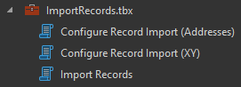

## Import Records

Toolbox and scripts for importing tables into an existing feature class within a web layer or file geodatabase.  

Geometry can be assigned to features using provided coordinate values in a known spatial reference system, or by geocoding an address associated with each incident.

These scripts can be scheduled using Windows Task Scheduler to automatically update the feature class and service.

## Features

* Features can be located using addresses or coordinate pairs
* Optionally, match fields from source table to target feature class using field mapping parameter
* Optionally, avoid creating duplicate records by update existing records and only adding new features to the service
* Run the tools manually through ArcGIS Pro, or schedule them to run regularly using Windows Task Scheduler

## Instructions

1. In the Catalog Pane, open the Configure Import Records tool (XY or Addresses). Complete the parameters and click OK to create a configuration file storing these parameter values.
2. Run the Import Records tool using the previously created configuration file as input.
3. Examine the output messaging and reports for comments on failures and data errors.
4. Optionally, set up Windows Task Scheduler to run Import Records automatically on a schedule with the configuration file as input.

## Requirements

- ArcGIS Pro
- ArcGIS Online organizational account or ArcGIS Portal

- Source table and feature class must have fields with a unique identifier for each record.

- To filter for duplicates, both the source table and the feature class must have fields with the date, and optionally time, of the record. This format can be modified by changing the Timestamp Format Parameter.

- All date, time, and timestamp fields in the source table should contain the following, in order of requirement:
	1. year
	- month
	- day
	- hour
	- minute

    For example, a field containing only the time 16:45 will cause the tool to fail because it is missing the year, month and day information associated with that time.
- These tools are set up to use the World Geocode service, which requires,  and consumes credits from, an ArcGIS Online organizational account.
	
	[Learn more about setting up a connection to the World Geocode Service](http://pro.arcgis.com/en/pro-app/help/data/geocoding/tutorial-geocode-a-table-of-addresses.htm)
	
	Optionally, use your own locator or geocode service. This requires some additional configuration of the scripts. Open import_records.py in IDLE or a text editor and modify the values of the following parameters located near the top of the script:
	- all\_locator_fields: in order, all the input address fields accepted by your locator
	- loc\_address_field: Your locator's input address field that looks for the house number and street name information
	- loc\_city_field: Your locator's input address field that looks for the city information
	- loc\_state_field: Your locator's input address field that looks for the state or province information
	- loc\_zip_field: Your locator's input address field that looks for the ZIP or postal code information

## Resources

* [ArcGIS Solutions](http://solutions.arcgis.com/)
* [ArcGIS Blog](http://blogs.esri.com/esri/arcgis/)
* [twitter@esri](http://twitter.com/esri)

## Issues

Find a bug or want to request a new feature?  Please let us know by submitting an issue.

## Contributing

Esri welcomes contributions from anyone and everyone. Please see our [guidelines for contributing](https://github.com/esri/contributing).

## Licensing
Copyright 2013 Esri

Licensed under the Apache License, Version 2.0 (the "License");
you may not use this file except in compliance with the License.
You may obtain a copy of the License at

   http://www.apache.org/licenses/LICENSE-2.0

Unless required by applicable law or agreed to in writing, software
distributed under the License is distributed on an "AS IS" BASIS,
WITHOUT WARRANTIES OR CONDITIONS OF ANY KIND, either express or implied.
See the License for the specific language governing permissions and
limitations under the License.

A copy of the license is available in the repository's [license.txt](license.txt) file.

​
